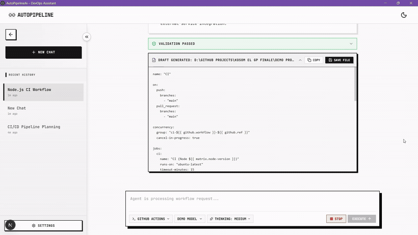
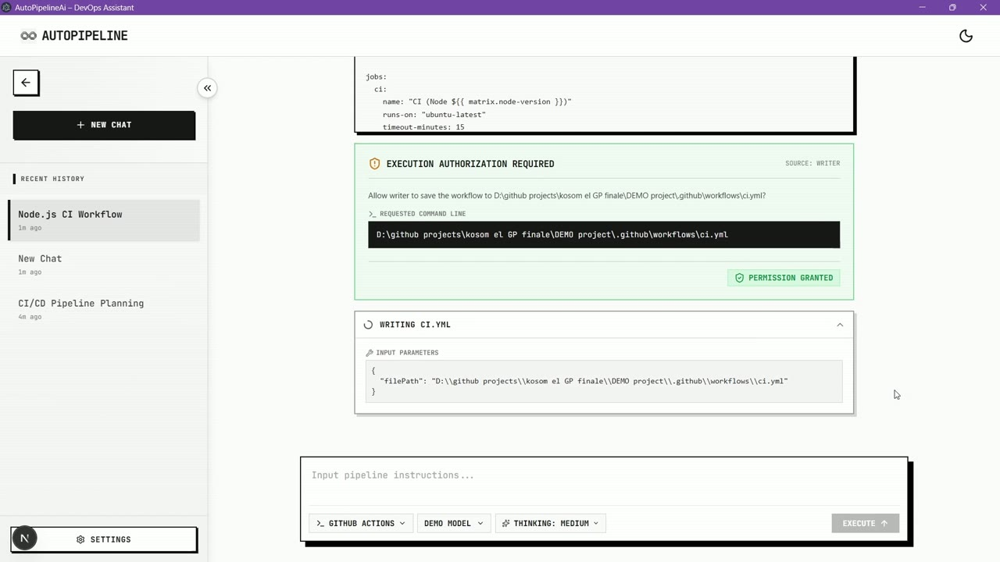

<p align="center">
  
</p>

# AutoPipeline

Hey 👋 — welcome to **AutoPipeline**, the one place where the whole
AutoPipeline product comes together. Instead of juggling three separate
repos and terminals, you run a single command here and get the full app —
agent, backend, and frontend — talking to each other in one desktop window.

This repo is a thin **launcher**: it fetches the three application
repositories, installs their dependencies, and starts them together as a
single desktop app.

<p align="center">
  
</p>

<p align="center"><em>One prompt → the agent analyzes the repo, plans, and generates a GitHub Actions pipeline live.</em></p>

You type one prompt in the window and everything runs end to end:

```
Frontend (Next.js)  ─►  Backend BFF (NestJS)  ─►  Agent (Python / FastAPI)
   :3001                    :3333                     :8000
   Electron desktop         proxies the              generates & validates
   window (the UI)          NDJSON stream            CI/CD workflow YAML
```

The three apps are pulled from their own repositories:

| App | Repository | Port |
|-----|-----------|------|
| Agent | https://github.com/Auto-Pipeline-AI/agent.git | 8000 |
| Backend | https://github.com/Auto-Pipeline-AI/backend.git | 3333 |
| Frontend | https://github.com/Auto-Pipeline-AI/frontend.git | 3001 |

They are cloned into `./apps/` (git-ignored) and never committed here.

## Prerequisites

- **Node.js ≥ 20** and npm
- **Python ≥ 3.11** (`py`, `python`, or `python3` on your PATH)
- **git**

That's it — no LLM API keys are needed to launch. You enter your provider key
in the app's LLM selector at runtime (it's stored encrypted by the desktop
shell, never in this repo).

## Usage

```bash
# 1. Fetch the three repos and install everything (run once, ~a few minutes)
npm run setup

# 2. Launch the whole stack + desktop window
npm start
```

`npm start` is self-healing: if `./apps` isn't set up yet, it runs `npm run
setup` for you first. Close the window (or press `Ctrl+C` in the terminal) to
stop all services.

### How it works

`npm start` starts the services in dependency order, waiting for each to be
healthy before starting the next:

1. **Agent** — `python -m agent` (uvicorn on `:8000`), waits for `/health`.
2. **Backend** — `npm run start:dev` with `PORT=3333` and
   `AGENT_URL=http://localhost:8000`, waits for the port to accept.
3. **Frontend** — `next dev` on `:3001`, then the frontend's own **Electron**
   shell opens the desktop window (it provides the folder picker, encrypted
   API-key storage, and file-save bridge the UI needs).

The SQLite database is created automatically per-OS by the backend
(`~/AppData/Local/apa/dev.db` on Windows) — no configuration required.

## Commands

| Command | Description |
|---------|-------------|
| `npm run setup` | Clone missing repos and install missing dependencies. |
| `npm run update` | `git pull` the three repos, then install. |
| `npm run setup:reinstall` | Force a clean reinstall of all dependencies. |
| `npm start` / `npm run dev` | Launch the full stack + desktop window. |
| `npm run clean` | Delete `./apps` to start over. |

## Typical flow in the app

1. Select a local project folder (or pick a recent one).
2. Choose an LLM provider/model and paste your API key.
3. Type what you want, e.g. *"Create a GitHub Actions CI pipeline for this
   project."*
4. Watch the agent analyze, plan, generate and self-correct the YAML live.
5. Approve the write, or copy / save the generated workflow file.

## Watch the full demo

<p align="center">
  <a href="assets/demo.mp4"></a>
</p>

<p align="center"><em>▶ Click to play the full end-to-end walkthrough (with audio).</em></p>

## License

MIT

## Visitors

<p align="center">
  
</p>
